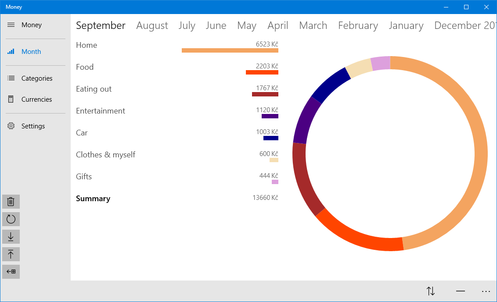
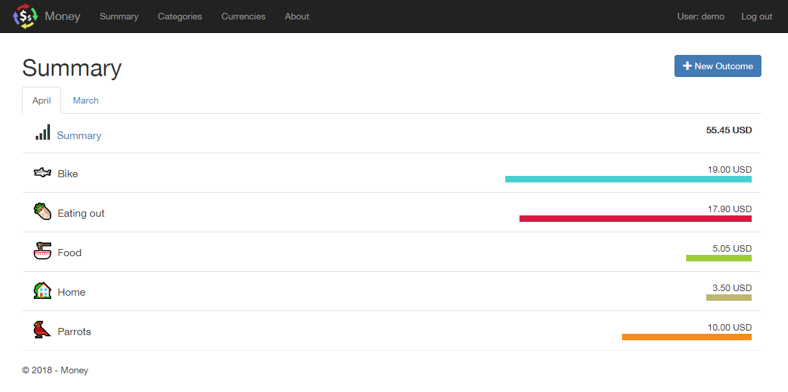

# Money
Money is an outcome logging application written as UAP (UWP) to target both desktop and mobile Windows devices. 
 
<a href='//www.microsoft.com/store/apps/9n50xhgw891s?ocid=badge'>Get it from Microsoft Store</a>.

Also, we have experimental implementation using [Blazor](https://github.com/aspnet/Blazor).

### Blog posts
 - [Blazor and the booting screen](https://www.neptuo.com/blog/2018/04/blazor-boot-screen/).
 - [Blazor and complex component parameters](https://www.neptuo.com/blog/2018/06/blazor-component-parameters/).
 - [Blazor and page parameters](https://www.neptuo.com/blog/2018/11/blazor-page-parameters/).
 - [Blazor and network](https://www.neptuo.com/blog/2019/12/blazor-network-status/).
 - [Blazor and the magic of App.razor](https://www.neptuo.com/blog/2020/03/blazor-app-razor).
